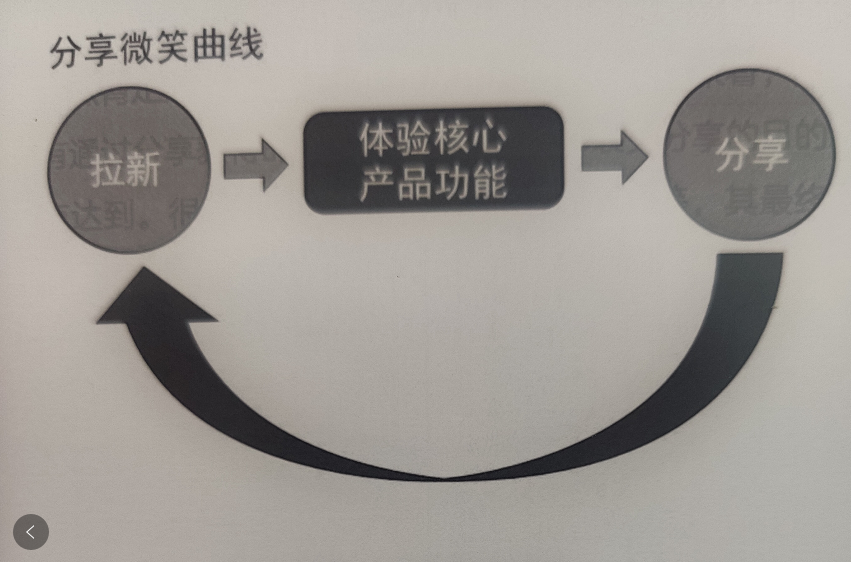

# 序言
###1、以终为始，增长是利用一切资源让用户更高频地使用核心产品功能
###2、用户增长的本质是通过数据驱动的迭代测试把主观认知变为客观认知，用测试的冗余性换取增长的确定性
###3、公司的一切经营活动都是围绕如何获取用户并提升用户的LTV（life time value,生命周期总价值）
###Tip:好久没写文，文字组织能力不太行，相对粗糙，有想深入了解用户增长的请移步《我在一线做用户增长：存量时代的用户运营之道》进行深入阅读

---

# 一、做用户增长前提  
确保产品的基础体验达到一定的门槛，才能让核心用户有相对较好的体验。正如海外社交项目刚上线的那一个月，我们并没有做过多的推广工作，因为产品的可玩性太少了，就只是具备基础的私信、通话、充值、用户信息完善等功能。
 另外，自己本身欠缺平台主播，严重依赖于api公会（不使用我们的产品，api公会有自己的app，双方通过http进行交互，有共同的rtc服务商），而api公会毕竟不是使用我们自己的app，问题也是相当多，成本也相对较高。
 用户进来体验并不会很好，大都也就成了过客而已，留不住。所以，产品基础体验的保障，对于做用户增长的必要性不言而喻。
---
# 二、如何做用户增长

### **1.用户增长定义：以终为始，利用一切资源让更多用户更高频地使用核心产品功能**

- “更多”涉及的是用户获取，主要是拉新
- “更高频”对应的是提升用户访问频次，但未必包含访问时长（根据产品定位，是否kill time 产品，海外社交就是一款kill time的产品）。
- “核心产品功能”非常重要却往往容易被忽略的一个要素。如果用户在使用产品时没有体验到该产品的核心功能，这对于产品而言绝对是一个损失。

### **2.实现用户增长，需要做的几点**
#### **- 根据公司战略，确定增长的阶段性目标是什么**   
-  他趣公司战略：知名的泛娱乐品牌企业 ==》衍生出==》海外社交，即是他趣海外泛娱乐迈出的第一步，第一款产品  
  
#### **- 阶段性目标（海外社交目前所经历过的阶段）：**  
-  a.2102~2104：产品调研及设计阶段  
-  b.2105~2106：产品研发测试到首次发包上线  
-  c.21年Q3: 产品功能及体验调整阶段，目标是：次留能达到20%以上
-  d.21年Q4：大目标：ROI打正（正在进行）
  
#### - **结合行业特性，深入思考，从目标倒推实现路径和相应增长项目**   
  **就以海外社交Q3的目标举个例子，首先是拉新，然后尽可能高的留存，而以下是我们为此做的几个相对突出的例子**：  
   
 - a.道具卡功能  
  目前有三种类型的道具卡：搭讪卡、私信卡、通话卡，也即是我们产品的核心功能点。现在主要是在用户注册、签到时作为奖励下发。其中，我觉得注册时下发是一个很妙的举措，因为对于一个刚进来的用户而言，他对于你的产品
  以及你产品的质量怎么样，其实他是不知道，要是你一开始就让他付费社交，大多数还是不愿意的。这时候，有了赠送的道具卡，他们就能先免费体验一下产品的功能，要是用户体验好了，get了他想要的点，他自然就有很大概率继续用我们产品。  
     
 - b.伪搭讪功能  
  这是项目初期就有的一个功能点，就是我们系统根据一定的推荐规则，模仿在线的主播给在线的用户进行私信消息下发，这是一种撮合主播和用户的一个相当有效的方式。另外，私信功能也是我们产品主打侧重的一个功能点，这也相当
  高效地促进用户去使用私信这个功能，用户玩进去了，我们目的也就达到了。  
    
 - c.社区及动态功能，主要有两个功能点：聊天广场和动态发布评论     
  <1>聊天广场：  
  有点像qq群，但是不是用户创建的，而是我们系统下发创建的一个大聊天室。在我感觉，这其实有点抓住了现在部分网友的性格，有很多网友其实私聊时不怎么聊得来，但是在一个群里的时候，他们就会聊得很嗨皮，然后要是聊天过程中
  遇到一些志趣相投的人的话，他们有较大意愿转私聊进行进一步的沟通。    
  <2>动态：  
  这就是个异变的“朋友圈”功能，只是发布消息的人，可能并不是好友。在我看来，这是一个促进用户与主播，用户与用户之间交流，加强彼此连结的一个有效手段。比如，我是一个用户，我想跟某个尚未接触过的主播，进行聊天，但我想要先
  了解一下这个主播的基本状况，而单纯的个人主页信息有太单调了，恰巧这个主播有发布一些动态，特别要是这个主播发布的又是贴近她真实生活的一些信息的话，这时候我就能根据动态更多地了解这个主播，辅以判断这个主播是不是我的菜，
  要不要进一步接触等等。  
 
 #### **- 四种用户增长类型：漏斗型、功能型、策略型、整合型**
  - a.漏斗型增长：  
  核心：提升用户从一个环节到另一个环节的转化率。把复杂的世界拆解成很多细小、简单的组成部分，如果每个部分的输入是确定的，那整体的输出其实也是确定的。  
  映射到海外社交产品而言，就是把用户在产品中的体验流程拆解成一个个细小的环节，通过用户每个环节的转化效率，提升用户整体的生命周期总价值（life time value, LTV）。  
  说道此处，不得不说一个比较著名的模型 ————  AARRR模型：获取用户（Acquisition）、提高活跃度（Activation）、提高留存率（Retention）、获取收入（Revenue）、自传播（Refer）  
  而我们的产品很多细节其实也都暗合了这样的一个模式。比如道具卡功能：  
  用户注册/签到 ==》 获得道具卡 ==》 体验私信、通话、搭讪核心功能 ==》 体验即将结束，友好地欠费充值提示 ==》 产生付费 ==》 用户留存
  
  - b.功能型增长：
  核心：为产品增加新的功能，促进用户增长  
  海外社交上线新增的道具卡、聊天广场及动态发布功能，一方面增加了产品的可玩性，另一方面也相对高效地促进了用户的留存。
  
  - c. 策略型、整合型，略~~~~（感兴趣的请自行阅读《我在一线做用户增长：存量时代的用户运营之道》 一书）
  ---
  
  #三、用户增长基本方法论
  ### 关键词： HVA -- high value action, 高价值行为
  ### 1.HVA模型：通过引导HVA来提升LTV
  #### a.优先引导价值更高的HVA，  
   仍旧以海外社交道具卡功能为例子，注册时奖励道具卡，可以有效引导用户产生发私信、搭讪、匹配的高价值行为。另外还有充值弹窗醒目的首冲优惠提示，有效引导用户进行充值。  
  #### b.有针对性地对用户产生HVA付出的成本进行补贴  
  海外社交的任务中心，有部分任务就符合这样的特质，比如用户每日产生一定量的付费通话、私信等就进行金币或道具卡的奖励。
  
  ### 2.提升LTV总量（ALTV）
  ####a.吸引更多的用户  
  也就是拉新，尽可能多的拉取新用户，提高用户基数。比如，我留存率稳定在10%，1000个用户就有有100个留下来，那要是1000w，就有100w，这就是相当可观的DAU。不过这种往往拉新前期可能相对好做，但是到达一定量级后，拉新成本跟用户产生的价值
  就会很容易不成正比。
  
  ####b.提升每个用户的LTV
   让用户更多体验到产品的可玩性，用户才能有更多的意愿花时间停留在你的应用上，然后就是更多地让用户产生HVA，不然与产品而言并无太多的意义。
   ###3.用慢思考来设计引导用户产生HVA的快思考产品逻辑
   #### 这涉及到一个理论 --- 双系统理论  
   该理论源自《思考，快与慢》一书，坐着丹尼尔.卡尼曼  
  - 系统1：快速、无意识的，就像条件反射，用系统1解决问题，我们会感到很爽、毫不费力  
  - 系统2：慢思考，需要我们耗费脑力去专注思考
  - 我们的大佬通常不倾向于用系统2解决问题，愿意用更简单快速的系统1来解决问题。而我们的产品在设计过程中，我们也应该更多地朝着调用用户的系统1而努力。遵循人体大脑这种特性，UI及产品功能设计能够按照一定框架来呈现信息，让他们快思考、迅速决策
  、跳转到下一步，让用户非常流畅地调动系统1来进行思考，这样才能提高转化率，产生我们期望产生的决策。海外社交产品中任务中心、推送消息的跳转功能就属于这样的一种方式。
  
  ###4.引导用户产生强烈的情感
  - 强烈的情感在决策过程中的影响是巨大的  
  强烈的情感反应会影响人们处理量化信息的能力。而通过群体共鸣或其他方式，让用户产生强烈的情感，就比较容易让用户转化。  
  群体对感性的东西比较敏感，对理性的东西却不太感冒。 --- 出自《乌合之众》
  强烈的情感容易在群体中传播，甚至于强烈的情感会屏蔽系统2。海外社交产品中的一些引导，我觉得就有这么点味道。比如rtc通话过程中，要是恰巧用户聊得正嗨，这时用户却即将余额不足，及时友好的充值弹窗，撞上用户此时强烈想要继续往下聊的情感，
  就极大地可能让用户产生付费行为。
  
  ###5.默认选项引导
  - 基于大脑最小能耗的原则，我们非常容易受环境中给定默认信息的影响。  
  海外社交，首冲优惠的标识就属于此类。
  
  ###6.先寸后尺
  - a. 劝用户购买自家产品之前，先让用户回答一些封闭性的小问题，而这些小问题的答案一般都是肯定的。这样，当你提出需要客户做出购买决策的大问题时，他们就倾向于给出肯定答案。
  - b. 直奔主题不一定效率更高，先找到容易让用户形成共识的点，再引导转化，效果会更好。
  - c. 打碎用户的决策链
  
  ###7.欲取先予---引发损失厌恶
  - 厌恶损失的用户更容易调用系统1去决策。就像海外社交产品，给每个充值额度都设定了一个首次该额度的优惠，对于厌恶损失，又有意愿长期使用我们产品的用户而言，他们就会将每个额度的优惠力度都争取到手，
  即使是较高的额度。
  
  ###8.创造认知引力场
  - 人的大脑中住着一个认知吝啬鬼，所以在分析处理问题时，能用简单的方式（快思考）肯定不用更复杂的方式（慢思考）

  - 光环效应（明星效应）就是一种认知引力场的影响。你因为某件事认可一个人，通常会把他的优点放大，认为他在其他方面也很好。就比如明星代言、带货就属于此类
  - 锚定和反锚定。日常生活中的砍价行为就属于这种，不过应用到各个领域时，需要考虑受众的情绪反应，以及是否需要多次博弈。
  - 其它方式：引用方法论、名言警句、顺口溜、行业案例 
  
  ###9. 分享笑脸模型
  - 核心：给予分享一定的奖励机制，促使用户自发地进行产品分享。
  - 最好的方式：分享裂变（拼多多分享抽高额现金案例）
  - 分享的用户最好是体验到核心产品功能的用户，如果只是迅速地把产品进一步做了分享，这类用户也只是“过客”，对于提升产品的LTV并无太大的意义。如下图  
  
  
   
   ###10.逆向思维
   #### 我们的思维也是有惯性的，倾向于看“车来的方向”。但很多时候，决定生死成败的，其实是我们能否看到“车逆行的方向”
  - a.“事前验尸”，做增长项目时，提前想下，如果这个项目失败了，可能是哪些因素导致的。
  - b.反脆弱架构，在用户搞崩系统之前，先想办法自己把系统搞崩，然后修复，再搞崩，慢慢使系统变得健壮。
  - c.做任何决策，尤其是涉及金钱投入时，要尽可能多地通过数据来决策
  
  # 四、快速迭代对于用户增长的必要性
  - “天下武功，唯快不破”，这句话用在用户增长上也是适用的，尤其是处于激烈竞争环境中时。
  - 用户增长的本质是通过数据驱动的迭代测试把主观认知变为客观认知，用测试的冗余性换取增长的确定性。如果不能实现快速迭代测试，是无法形成增长势能的。对于像海外社交这种尚处于初期的产品更是如此了，
  特别是在基本完全陌生的海外市场。我们也更应该通过快速的迭代方式，去尝试新的功能、优化已有的问题、提升用户体验等等各式各样的迭代，去摸索一些行之有效的用户增长项目。
  - 很多测试都是以失败告终，是沿着失败假设的逻辑来做的，很少会有毕其功于一役的情况出现。所以，即使某些用户增长项目失败，我们也不应该气馁。
  
  # 五、结语
  
 ### 谢谢阅读
  
 
   
    
   
  

  
  
  
  
  
  
