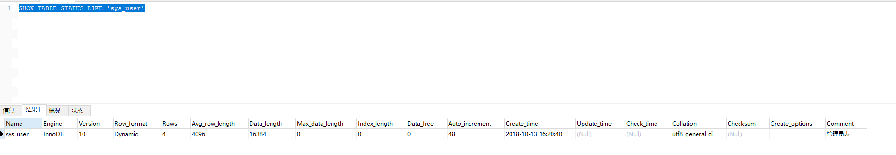

# 一、MySQL逻辑架构
---

## 1.1 逻辑机构图


- 最上层大多数是基于网络的C/S架构的工具或者服务都有类似的架构。比如连接处理，授权认证，安全等。
- 第二层架构主要包括MySQL的核心功能，包括查询解析、分析，优化、缓存以及所有的内置函数，同时包括存储过程，触发器 ，视图等
- 第三层包含了存储引擎。存储引擎负责MySQL中的数据存储和提起。

## 1.2 连接管理与安全性

- 每个客户端连接都会在服务器进程中拥有一个线程，这个连接的查询只会在这个单独的线程中执行，该线程只能轮流在某个CPU核心或者CPU中运行。
- 服务器会缓存线程，因此不需要每一个新建连接创建或销毁线程
- 连接认证基于用户名原始主机信息和密码以及安全套接字（SSL）方式连接

# 二、并发控制

## 1.1 读写锁

- 在处理并发读或者写时，可以通过实现一个由两种类型的锁组成的锁系统来解决问题
- 这两种类型的锁通常被称为**共享锁(shared lock)** 和 **排他锁(exclusive lock)**，也叫**读锁(read lock)**和**写锁(write lock)**
- 读锁是共享的，或者说是相互不阻塞的。多个客户在同一时刻可以读取同一个资源，而互不干扰
- 写锁则是排他的，也就是说一个写锁会阻碍其他的写锁和读锁

## 1.2 锁粒度

- 一种提高共享资源并发性的方式就是让锁定对象更有选择性。
- 尽量只锁定需要修改的部分数据，而不是所有的数据
- 锁策略，就是在锁的开销和数据的安全性之间寻求平衡
- 两种锁策略：
<br>
    1.表锁：<br>
    表锁是MySQL中最基本的锁策略，并且是开销最小的策略<br>
    表锁会锁定整张表。用户在对表进行写操作前，需要先获得写锁，这会阻塞其他用户对该表的读写操作。<br>
    只是没有写锁时，其他读取的用户才能获得的读锁，读锁之间不相互阻塞<br>
    写锁比读锁有更高的优先级，因此一个写锁请求可能会被插入到读锁队列的前面<br>
    2.行级锁：<br>
    行级锁可以最大程度地支持并发处理（同时也带来了最大的锁开销）<br>
    行级锁只在存储引擎实现，而MySQL服务器层没有实现<br>

# 三、事务    

## 3.1 基础概念

- 事务就是一组原子性的SQL查询，或者说一个独立的工作单元。
- 事务内的语句，要么全部执行成功，要么全部执行失败。
- ACID概念：<br>
    1.原子性：<br>
    一个事务必须被视为一个不可分割的最小工作单元，整个事务中的所有操作要么全部提交成功，要么全部回滚失败。<br>
    2.一致性：<br>
    指数据库事务不能破坏关系数据的完整性以及业务逻辑上的一致性。<br>
    3.隔离性：<br>
    在一个事务或者工作单元执行完毕之前，其所访问的数据不能受到系统其他部分的影响。这就是隔离性。<br>
    4.持久性：<br>
    一旦事务提交，则其所做的修改就会永久保存到数据库中。此时即使系统崩溃，修改的数据也不会丢失。<br>
 
 ## 3.2  隔离级别
 
 
 - READ UNCOMMITTED（未提交读）：  
    在READ UNCOMMITTED级别，事务中的修改，即使没有提交，对其他事务也都是可见的。事务可以读取未提交的数据，这也被称为脏读(Dirty Read)。在实际中很少使用
 
 - READ COMMITTED（提交读）：  
    大多数数据库系统的默认隔离级别都是READ COMMITTED（但MySQL不是）。  
    Read COMMITTED满足隔离性的简单定义：一个事务开始时，只能“看见”已经提交的事务所做的修改。换句话说，一个事物从开始到提交之前，所做的任务修改对其他事务都是不可见的。  
    这个级别有时也叫不可重复度（nonrepetable read），因为执行两次同样的查询，可能会得到不同的结果  
 
 - REPEATABLE READ（可重复读）：  
    REPEATABLE READ解决了脏读的问题。这级别保证了在同一个事务中多次读取同样记录的结果是一致的。  
    主要实现是当A事务读取了数据后，会对数据进行加锁，这样就可以保证数据的一致性。但是不能组织B使用insert语句插入数据，这就导致会发生幻行(Phantom Read)，会发现表的行数不一样。
  
 - SERIALIZABLE（可串行化）：  
    SERIALIZABLE是最高的隔离级别。它通过强制事务串行，避免了前面说的欢度问题。
    但是会出现大量超时和锁争用的问题。  
    只有在非常需要保证数据的一致性且可以接受没有并发的情况下，才使用该级别  
  
 ## 3.3 死锁
 
 - 死锁是指两个或者事务在同一个资源上相互占用，并请求锁定对方占用的资源，从而导致恶性循环的现象。
 - 死锁发生后，只有部分或者完全回滚其中一个事务，才能打破死锁。
 
 
 
 ## 3.4 事务日志
 
 - 使用事务日志，存储引擎在修改表的数据时只需要修改其内存拷贝，再把该修改行为记录到持久在硬盘上的事务日志中，而不是每次豆浆修改的数据本身持久到磁盘。
 - 事务日志的方式相对来说要快得多。事务日志持久后，内存中被修改的数据在后台可以慢慢地刷回磁盘。
 
 ## 3.5 MySQL中的事务
 
 - 自动提交（AUTOCOMMIT）：<br>
    MySQL默认采用自动提交的方式。如果不显式的开始一个事务，则每个查询都会被当作一个事务执行提交操作。  
    可以通过设置来开启或禁用自动提交。（1或者ON表示开启，0或者OFF表示禁用）  
    ```sql
       SHOW VARIABLES LIKE 'AUTOCOMMIT'  --查看是否开启自动提交
       SET AUTOCOMMIT = 1;   --开启自动提交
   ```    
    MySQL可以通过SET TRANSACTION ISOLATION LEVEL命令来设置隔离级别。新的隔离级别会在下一个事务开始的时候生效。  
    ```sql
       SET SESSION TRANSACTION ISOLATION LEVEL READ COMMITTED;
   ```
   MySQL的服务层不管理事务，事务由下层的存储引擎实现的。所以在同一个事务中，使用多种存储引擎是不可靠的。  
 
# 四、 多版本并发控制（MVCC）

- MVCC的实现，是通过保存数据在某个时间点的快照来实现的。也就是说，不管需要执行多长时间，每个事务看到的数据都是一致的。
- 根据事务开始的时间不同，每个事务对同一张表，同一时刻看到的数据可能是不一样的。
- MVCC的工作原理：  
    1、InnoDB的MVCC是通过在每行记录后面保存两个隐藏的列来实现的。这两个列，一个保存了行的创建时间，一个保存行的过期时间。当然存储的并不是实际时间值，而是系统版本号  
    2、每开始一个新的事务，系统版本号都会自动递增。事务开始时刻的系统版本号会作为事务的版本号，用来和查询到的每行记录的版本号进行比较。

# 五、 MySQL的存储引擎

- 使用SHOW TABLE STATUS命令查看表相关信息


## 5.1 InnoDB存储引擎：  
    1、InnoDB的数据存储在表空间中，表空间是由InnoDB管理的一个黑盒子，由一系列的数据文件组成。  
    2、InnoDB采用MVCC来支持高并发，并且实现了四个标准的隔离原则。默认级别是REPEATBALE READ（可重复读），并且通过间隙锁（next-key locking）策略防止幻读的出现。  
    3、InnoDB表是基于聚簇索引建立的。聚簇索引对主键查询有很高的性能。  
    4、InnoDB内部做了很多优化，包括从磁盘读取数据时采用的可预测性预读，能够在内存中创建hash索引以加速读操作的自适应哈希索引，以及能够加速插入操作的插入缓冲区  
    5、支持真正的热备份。
## 5.2 MyISAM存储引擎：  
    1、在MySQL5.1及以前的版本，MyISAM是默认的存储引擎。  
    2、MyISAM提供了大量的特性，包括全文索引，压缩，空间函数等。  
    3、但MyISAM不支持事务和行级锁，还有一个缺陷就是崩溃后无法安全恢复

## 5.3 InnoDB和MyISAM比较
    1、事务：InnoDB 是事务型的，可以使用 Commit 和 Rollback 语句。
    2、并发：MyISAM 只支持表级锁，而 InnoDB 还支持行级锁。
    3、外键：InnoDB 支持外键。
    4、备份：InnoDB 支持在线热备份。
    5、崩溃恢复：MyISAM 崩溃后发生损坏的概率比 InnoDB 高很多，而且恢复的速度也更慢。
    6、其它特性：MyISAM 支持压缩表和空间数据索引。

    