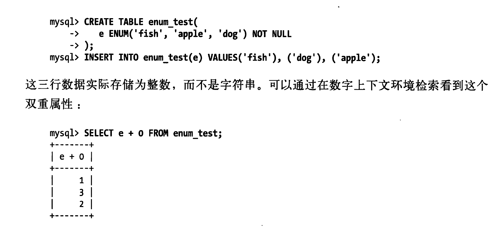
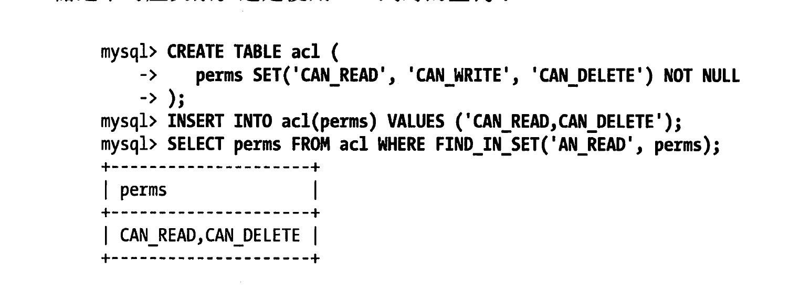
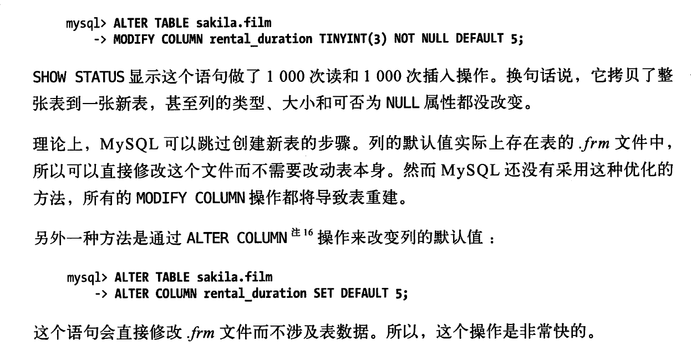

# 一、 选择优化的数据类型
- 更小的通常更好
    1、一般情况下，应该尽量使用可以正确存储数据的最小数据类型。更小的数据类型通常更快，因为它们占用更少的磁盘、内存和CPU缓存，并且处理时需要的CPU周期也更少。  
    2、如果无法确定哪个数据类型更好，就选择你认为不会超过范围的最小类型。  

- 尽量避免NULL
    1、通常情况下最好指定列为NOT NULL，除非真的需要存储NULL值。  
    2、存在NULL的列使得索引、索引统计和值比较都更复杂。可为NULL的列通常需要更多的存储空间，每个索引记录需要一个额外的字节

- 简单就好
    1、简单数据类型的操作通常需要更少的CPU周期
 
 ## 1.1 整数类型
- 有两种类型的数字：整数和实数。如果存储整数，可以使用TINYINT(8位),SMALLINT(16位),MEDIUMINT(24位),INT(32位),BIGINT(64位)

- 整数类型有可选的UNSIGNED属性，表示不允许负值，这大致可以使正数的上限提高一倍。

- MySQL可以为整数类型指定宽度，例如INT(11)，但是对于大多数应用来说是没有意义的，只是用来显示字符的个数。对于存储和计算来说INT(1)和INT(20)是相同的

## 1.2 实数类型
- 实数是带有小数部分的数字。

- FLOAT和DOUBLE类型支持使用标准的浮点运算进行近似计算。
- DECIMAL类型用于存储精确的小数和计算精确的小数。
- 浮点和DECIMAL类型都可以指定精度。对于DECIMAL列，可以指定小数点前后所允许的最大位数，这会影响到列的空间消耗。例如DECIMAL(18,9)小数点两边将各存储9个数字。
- 浮点类型在存储同样范围的同时，通常比DECIMAL使用更少的空间。FLOAT使用4个字节存储，DOUBLE使用8个字节进行存储。MySQL使用DOUBLE作为内部浮点计算的类型。

## 1.3 字符串类型

- VARCHAR  
    1、VARCHAR类型用于存储可变长字符串，是最常见的字符串数据类型。它比定长类型更节省空间。当存储为VARCHAR值时，MySQL不会删除所有的末尾空格  
    2、VARCHAR需要使用1或2个额外字节记录字符串的长度：如果列的长度小于或等于255字节，则只使用1个字节表示，否则使用2个字节。

-  CHAR  
    1、CHAR类型是定长的：MySQL总是根据定义的字符串长度分配足够的空间。当存储为CHAR值时，MySQL会删除所有的末尾空格  
    2、CHAR适合存储很短的字符串，或者所有值都接近于同一个长度。例如，CHAR非常适合存储密码的MD5值，因为这是一个定长的值。  
    3、对于非常短的列，CHAR比VARCHAR在存储空间上也更有效率，因为VARCHAR需要额外一个字节去记录长度  

- BLOB和TEXT类型
    1、BLOB和TEXT都是为了存储很大的数据而设计的字符串数据类型，分别采用二进制和字符方式存储。  
    2、BLOB和TEXT家族之间仅有的不同时BLOB类型存储的是二进制数据，没有排序规则或字符集。而TEXT类型有字符集和排序规则  

- 使用枚举(ENUM)代替字符串类型
    1、有时可以使用枚举列代替常用的字符串类型。枚举列可以把一些不重复的字符串存储成一个预定义的集合。MySQL在存储枚举时非常紧凑，会根据列表值的数量压缩到一个或者两个字节中。  
    2、示例：
    

## 1.4 日期和时间类型

- DATETIME
    1、这个类型能保存大范围的值。从1001年到9999年，精度为秒。  
    2、它把日期和时间封装到格式为YYYYMMDDHHMMSS的整数中  
    3、与时区无关，使用8个字节的存储空间  
    4、默认情况下是可排序，例如“2008-01-16 22:37:08”  

- TIMESTAMP  
    1、TIMESTAMP类型保存了从1970年1月1日午夜（格林尼治标准时间）以来的秒数，它和UNIX时间戳相同。  
    2、TIMESTAMP只使用4个字节的存储空间，因此它的范围比DATETIME小得多：只能表示从1970年到2038年  
    3、与时区无关，使用8个字节的存储空间  
    4、默认情况下是可排序，例如“2008-01-16 22:37:08”  

## 1.5 位数据类型

- BIT类型  
    1、可以使用BIT列在一列中存储一个或多个true/false值。BIT(1)定义一个包含单个位的字段，BIT(2)存储2个位。BIT列的最大长度是64个位。  
    2、BIT的存储因不同的存储引擎而不同。MyISAM会打包所有的BIT列，所以17个单独的BIT列只需要17个位存储。其他存储引擎如InnoDB，为每个BIT列使用足够存储的最小整数类型来存放。  
    3、需要谨慎使用BIT数据类型。MySQL把BIT当做字符串类型，而不是数字类型。

- SET
    1、如果需要保存很多true/false值，可以考虑合并这些列到一个SET数据类型，它在MySQL内部是以一系列打包的位的集合来表示的，有效地利用了空间  
    2、一个包装位的应用的例子是保存权限的访问控制列表(ACL)。每个位或者SET元素代表一个值，例如CAN_READ、CAN_WRITE、CAN_DELETE。如果使用SET列，可以让MySQL在列定义里存储位到值的映射关系；如果使用整数列，则可以在医用代码里存储这个对应关系。  
    3、ddl和查询示例：  
    
    
# 二、MySQL schema 设计中的陷阱

## 2.1 太多的列

- MySQL的存储引擎API工作时需要在服务层和存储引擎层之间通过缓冲格式拷贝数据，然后再服务器层将缓冲内容解码成各个列。

- 从行缓冲将编码过的列转换成行数据结构的操作代价非常高。转换的代价依赖于列的数量。

## 2.2 太多的关联

- “实体-属性-值”（EAV）设计模式是一个糟糕的设计模式，尤其是在MySQL下不能靠谱工作，需要许多自关联。

- MySQL每个关联操作最多只能有61张表

- 单个查询最好在12个表以内做关联

## 2.3 全能的枚举

- 注意防止过度使用枚举（ENUM）

# 三、 范式和反范式

## 3.1 范式的优缺点
- 优点：  
    - 范式化的更新操作通常比反范式化要快
    - 当数据具有较好的范式化时，就只有较少或者没有重复数据，所以只需要修改更少的数据
    - 范式化表通常更小，可以更好地放在内存里，所以执行操作会更快
    - 很少有多余的数据意味着检索列表数据时更少需要DISTINCT或者GROUP BY语句

- 缺点：
    - 范式化设计的schema通常需要关联
    - 稍微复杂的查询语句都可能需要至少一次关联，也许更多。不但代价昂贵，也可能使一些索引失效

## 3.2 反范式的优缺点
- 优点
    - 所有数据都在一张表中，可以很好地避免关联
    - 当数据比内存大时可能比关联要快得多，因为避免了随机I/O
    - 更有效地使用索引策略
- 缺点
    - 可能会一张表有太多的列，变成宽表

## 3.3 混用范式化和反范式化

# 四、 缓存表和汇总表

- 有时提升性能最好的方法是在同一张表中保存衍生的冗余数据。然而有时也需要创建一张完全独立的汇总表或缓存表。
- 缓存表是存储那些可以比较简单地从scema其他表获取（但是每次获取的速度表较慢）数据的表。
- 汇总表则保存的是GROUP BY 语句聚合数据的表

# 五、加快ALTER TABLE 操作的速度

- 大部分ALTER TABLE操作间导致MySQL服务中断。常见场景解决技巧：
    - 1、先在一台不提供服务的机器上执行ALTER TABLE操作，然后和提供服务的主库进行切换
    - 2、“影子拷贝”，用要求的表结构创建一张和源表无关的新表，然后通过重命名和删表操作交换两张表。

- 所有的MODIFY COLUMN操作都将导致表重建

# 四、缓存表和汇总表

